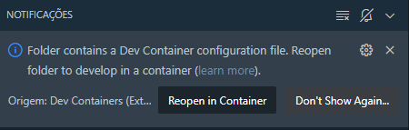
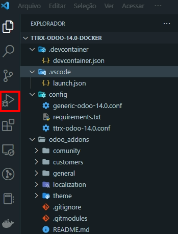
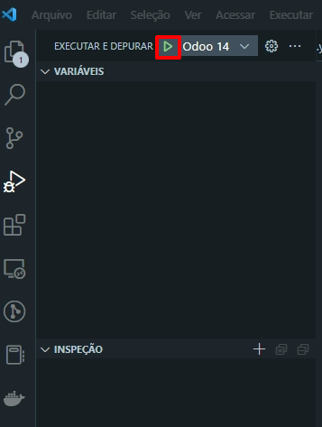
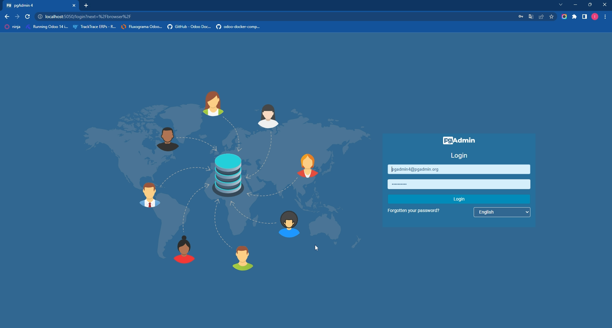
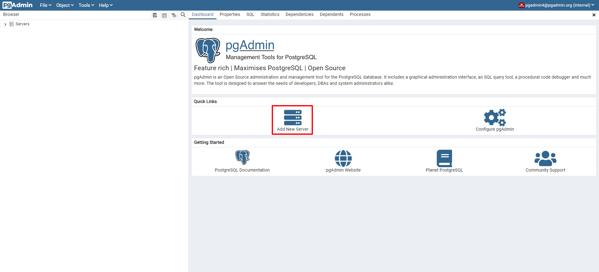
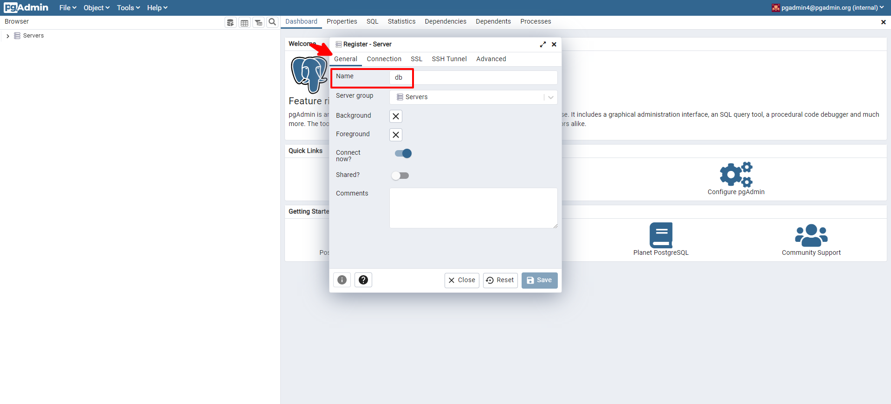
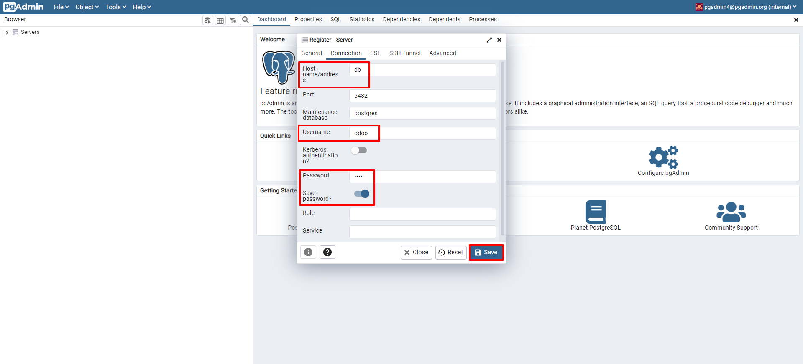
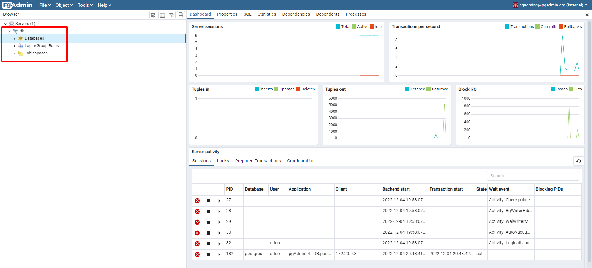

# TTRX Odoo 14 Docker Container Builder

## Welcome to this project!

This project aims to provide an automation level to scale up the developer environment locally using Docker solutions

## Pre Requisites

To buld, run, debug and code in Odoo ERP Dev Environment, um must fullfill some requirements, listed below 

<ol>
    <li>
        <a href="https://git-scm.com/book/en/v2/Getting-Started-Installing-Git">Install GIT (Linux / Mac / Windows)</a>
    </li>
    <li>
        <a href="https://code.visualstudio.com/download">Install VS Code (Linux / Mac / Windows)</a>
    </li>
    <li>
        <a href="https://marketplace.visualstudio.com/items?itemName=ms-vscode-remote.remote-containers">Install Dev Container in VS Code</a>
    </li>
    <li>
        <a href="https://docs.docker.com/get-docker/">Install Docker (Linux / Mac / Windows)</a>
    </li>
    <li>
        <a href="https://code.visualstudio.com/docs/containers/overview">Docs: Docker in VS Code</a>
    </li>
    <li>
        <a href="https://code.visualstudio.com/docs/devcontainers/containers">Docs: Developing inside a Container</a>
    </li>
</ol>

Once you have done this, now you can clone this repository to your filestore, just open the terminal and type:

    git clone -b 14.0 https://github.com/Isaachintosh/ttrx-odoo-14.0-docker.git

Now that you have the folder at your filestore, you can enter in it to clone or move your, or, third-party odoo addons:

    cd ttrx-odoo-14.0-docker/

    git clone -b 14.0 https://github.com/username/remote-custom-odoo-addons-repository.git

Now you can open this folder at the VS Code

# 
## Building the Dev Container

Automatically, the Dev Container Extension will read the files and show an notification like that below:

Just click at the Reopen in Container Button to make the Dev Container Build the Dev Environment by itself.

#
## Starting the Odoo Server inside the Container

Once the installation ends, you can click on the Execute and Debug Icon in the VS Code Menu:

 
 

Now click at the Play Icon to Begin the Debug

 
 

You can notice that will appear a floating menu containing some actions, that are Pause/Continue | Jump next Step | Next Step | Previous Step | Restart | Stop

#
## Accessing Odoo Server at Web Broser

To access the Odoo Server, just open this address:

<a href="http://localhost:8072">http://localhost:8072</a>

#
## Configuring PGAdmin4

Once you conclude the initialization of the Odoo Server, we need to create a local server instance into the pgadmin manager.

To do this we gonna access the link below in the web browser:

<a href="http://localhost:5050">http://localhost:5050</a>

The server will show this screen in the browser

 
 

To login, just type de default e-mail and password:

    email: pgadmin4@pgadmin.org
    password: admin@2022

 
 

Now we gonna click in <strong>Add New Server</strong>

 
 

The system will show a wizard, where we gonna set up our db server inside pgadmin.
The name will be "db", at the <strong>General</strong> options, as shown in the screenshot below

 
 

Now at the <strong>Connection</strong> option, we gonna set up the host, username and password. That will be:

    host: db
    username: odoo
    password: odoo
    remember password?: checked (activated)

 
 

Just type at the <strong>Save</strong> button to save the parameters.

And the system will update the screen as shown below:

#
## Python Dependencies for BR Fiscal Databases

If you gonna restore or use Fiscal Brazilian Database Backups you'll need to install some python lib dependencies, that are located inside extra-adoons/localization/brazil/br2

To do this, you will type this command at the terminal, BEFORE load the Database Backup:

    pip3 install --upgrade pip wheel "setuptools==58.0.0"

    pip install -r /usr/lib/python3/dist-packages/odoo/extra-addons/localization/brazil/br2/requirements.txt

